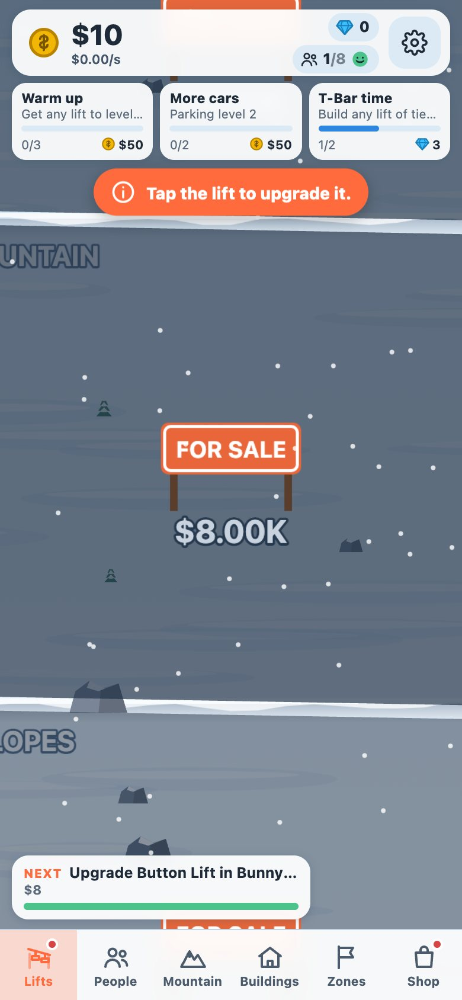
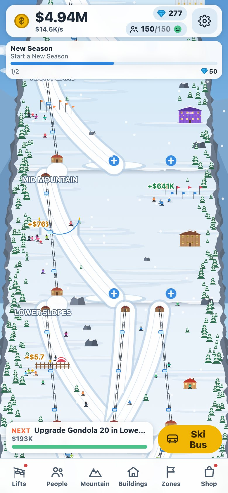
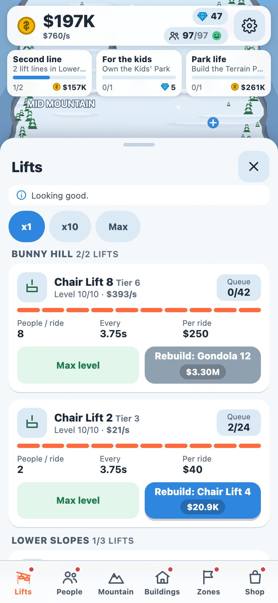
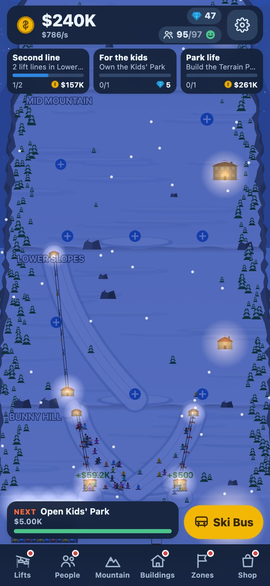

# Ski Idle Tycoon

A portrait 2D idle tycoon for phones. You build and upgrade a ski resort: real little people arrive, queue, ride your lifts, ski down, get angry when queues are too long, and **every single ride pays**. Web first (Phaser 4 + TypeScript + Vite), wrapped with Capacitor for Android and iOS.

The whole game is drawn in code (canvas 2D baked into textures, inline SVG icons): there are no image assets.

<p align="center">
  
  
  
  
</p>

```bash
npm install
npm run dev            # http://localhost:5173  (?debug for debug keys, ?new for a fresh save)
npm test               # 48 unit + playthrough tests
npx playwright install chromium   # one time, needed by the browser tests below
npm run smoke          # Playwright: canvas, first upgrade, six sheets, map tap, drag, autosave
npm run flows          # Playwright: save/load, offline dialog, quests, ski bus, shop, New Season
npm run simulate -- --fast --report   # balance bot, writes docs/balance-report.md
```

## Where to look
| | |
|---|---|
| `docs/MORNING.md` | start here: what happened overnight, what to look at, what to decide |
| `docs/concept.md` | the full design spec (single source of truth) |
| `docs/journal.md` | chronological log of what was built, what was tried and dropped |
| `docs/decisions.md` | every choice made where the spec was silent |
| `docs/roadmap.md` | done / not done / ideas for later |
| `docs/removed-and-alternatives.md` | things that were replaced or removed, with the tag/path to get each one back |
| `docs/balance-report.md` | balance bot timeline vs targets and the tuned cost multipliers |
| `docs/testing.md` | every test and tool, what it checks |
| `docs/design-tables.md` | lift tiers, areas, capacity, buildings and zones as generated tables |
| `docs/native.md` | Android / iOS build notes and the pre-release checklist |
| `screenshots/` | per-step screenshot map (`screenshots/README.md` indexes it) |
| `src/core` | pure TypeScript simulation, economy, quests, prestige, save, balance bot (runs in Node) |
| `src/scene` | Phaser map: art baked in code, camera, lifts, guests, buildings, zones |
| `src/ui` | HTML/CSS overlay: top bar, quests, sheets, dialogs, tutorial, sound |

## Git layout
`main` is the current, complete build. Tags `m2-core`, `m3-map`, `m4-m6-ui`, `m7-m8-polish-native` mark milestones. `option/*` branches hold alternative takes (see `docs/roadmap.md`).
